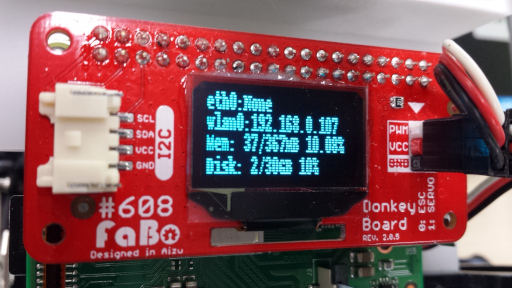

# OS起動時にOLEDにIPアドレスを表示



## 概要
新しいFaBo DonkeyBoardに搭載してあるOLEDに、OS起動後からIPアドレスを表示します。<br>
OS起動後に有線LANと無線LANのIPアドレス確認を10秒間おこなった後、OLED表示更新を停止します。<br>
この間にネットワークに接続されれば、OLEDにIPアドレスが表示されます。<br>
また、この処理は10秒後に停止するため、その後はDonkeyCarでOLEDを使うことも可能です。

## 前提
DonkeyCarのインストール

## ファイルコピー
```
git clone https://github.com/FaBoPlatform/ip_address_display
mkdir -p ~/fabo/bin
cd ip_address_display
cp oled_ip* ~/fabo/bin
cp oled.py ~/projects/donkeycar/donkeycar/parts/
```

## rc.local有効化
```
sudo systemctl status rc.local
sudo systemctl daemon-reload
sudo systemctl start rc.local
sudo systemctl status rc.local
```

## 再起動
再起動後、ネットワークに接続されていればOLEDにIPアドレスが表示されます。
```
sudo reboot
```

